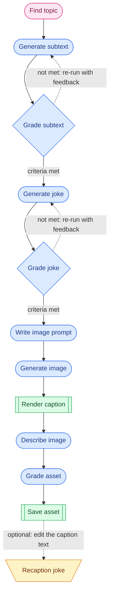
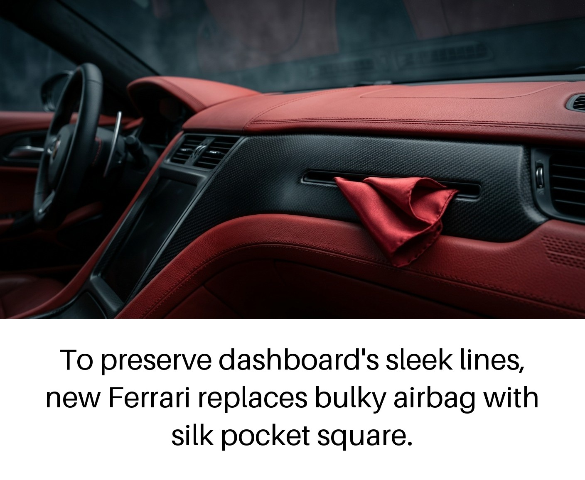
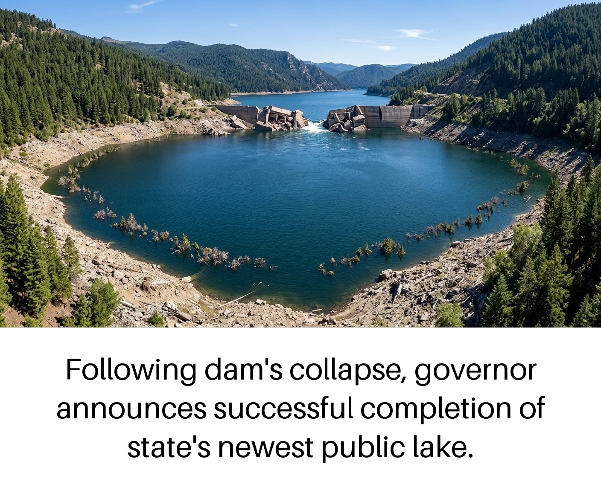

# comedy-factory

## Joke Generator Workflow

Legend: pink nodes are **Agent** steps; blue nodes are **Augmented LLM** steps (diamond = evaluation gate); green nodes are **System** steps; amber nodes are **Human** steps. Dotted edges are feedback loops or optional steps.

## Example output

