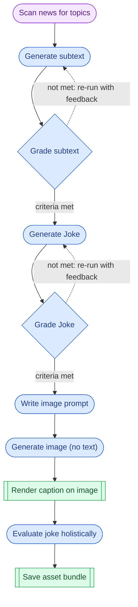

# comedy-factory

## Joke Generator Workflow

Legend: purple nodes are **Agent** steps; blue nodes are **Augmented LLM** steps (diamond = evaluation gate); green nodes are **System** steps. Dotted edges are feedback loops.

Other considerations:
* Alter image/font style (e.g., line sketch, realistic, anime, etc.)
* Include a "post to social" step (human)
